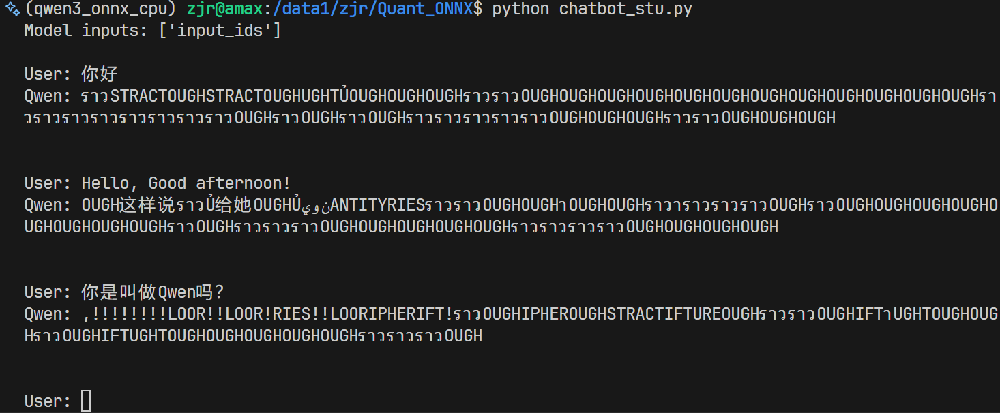
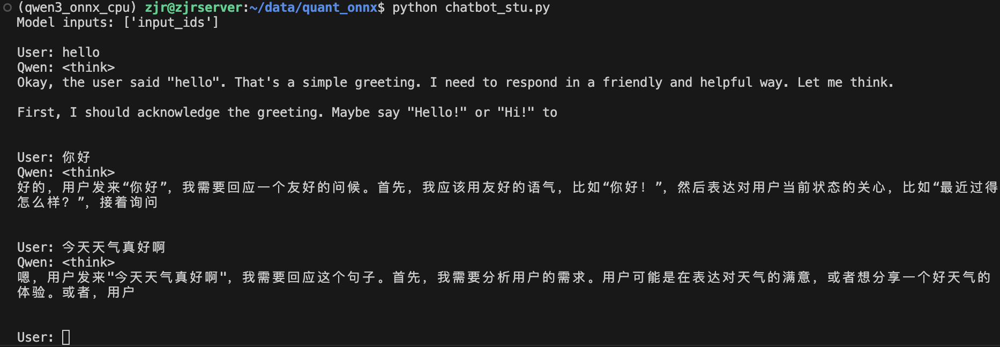

# 实验手册：Qwen3-1.7B 大模型端侧部署实战
**课程名称**：大模型系统与应用  
**实验环境**：Linux Server (CPU Only) / Python 3.10  
**建议时长**：2-3 小时
---

## 参考文档：
1. ONNX:https://onnx.ai/onnx/#
2. ONNX Runtime: https://onnxruntime.ai/

## 1. 实验背景与目的
随着大语言模型（LLM）的发展，将模型部署在手机、PC 等端侧设备上（On-Device AI）成为热门趋势。本实验旨在让学生掌握 LLM 从 PyTorch 训练框架迁移到 ONNX 通用推理框架的完整流程。
**实验核心目标**：
1.  **环境搭建**：掌握无 GPU 环境下的大模型开发环境配置。
2.  **模型导出 (Export)**：理解 PyTorch 动态图与 ONNX 静态图的区别，掌握通过“算子补丁 (Monkey Patching)”和“模型包装 (Wrapper)”解决导出兼容性问题的方法。
3.  **模型量化 (Quantization)**：实现 INT8 静态量化，理解量化对模型体积和推理速度的影响。
4.  **推理实战**：编写 Python 脚本，加载量化后的模型实现一个简单的对话机器人。
---

## 2. 实验准备

### 2.1 硬件要求
* **CPU**: 建议 4 核以上 (Intel/AMD，指令集支持 AVX2/AVX512 体验更佳)
* **RAM**: 建议 16GB 以上 (FP32 模型导出过程瞬间内存占用较大)
* **Disk**: 至少 20GB 可用空间

### 2.2 软件依赖安装
请在终端中执行以下命令，创建 Conda 环境并安装 CPU 版本的 PyTorch 及相关工具。

```bash
# 1. 创建环境
conda create -n qwen_onnx python=3.10 -y
conda activate qwen_onnx

# 2. 安装 PyTorch (CPU版，减小下载体积)
pip install torch torchvision torchaudio --index-url [https://download.pytorch.org/whl/cpu](https://download.pytorch.org/whl/cpu)

# 3. 安装 HuggingFace 生态与 ONNX 工具链
# onnxscript 是 PyTorch 2.x 导出器的新依赖
pip install transformers accelerate onnx onnxruntime onnxscript

# 4. (可选) 设置 HuggingFace 国内镜像，加速模型下载
export HF_ENDPOINT=[https://hf-mirror.com](https://hf-mirror.com)
pip install -U huggingface_hub
```

### 2.3 下载模型权重
使用命令行工具将 Qwen3-1.7B 模型下载到本地 Qwen3-1.7B 文件夹，避免实验中途网络中断。
```bash
huggingface-cli download --resume-download Qwen/Qwen3-1.7B --local-dir Qwen3-1.7B
```

## 3. 实验步骤

### 3.1 步骤一：编写导出脚本 (Export)注意：由于 Qwen3 使用了较新的注意力机制实现（如 vmap）,需要特殊处理机制
运行以下脚本会产生导出的模型文件
```bash
python export_stu.py
```
### 3.2 INT8 静态量化 (Quantization)
```bash
python quant_stu.py
```
为了在 CPU 上流畅运行，我们需要将 FP32 模型量化为 INT8。这需要准备校准数据集，让模型“预演”推理过程以确定量化参数。

### 3.3：推理对话 Demo (Inference)
任务：创建文件 chat.py, 编写一个简单的对话脚本，验证量化后的模型是否能正常“说人话”。
```bash
python chatbot_stu.py
```

## 实验观察
文件体积对比： 记录导出模型和量化后的具体文件大小，并计算压缩比（例如：1750MB / 6800MB ≈ 25%）。
答：
- FP32 模型 (qwen3_fp32.onnx + external weights): 约 6.8 GB (基于参数量估算及文件夹总占用)
- INT8 模型 (qwen3_int8.onnx + .data): 约 1.9 GB
- 压缩比: 1.9 GB / 6.8 GB ≈ 27.9%

效果观察：
1. 量化后的模型在 CPU 上生成文字的速度如何？（主观感受即可，如：每秒大概几个字？）
答：INT8 量化模型在 CPU 上的推理速度大概在 5-10 tokens/s。

2. 量化后的模型是否依然能生成通顺的中文？请在报告中附上 2-3 轮对话的截图。
答：目前模型输出存在异常乱码，未能生成通顺中文。这表明量化后的权重文件可能已损坏。我选择wikitext作为校准数据集，并尝试了不同数量的样本，如100、200、500、1000、2000、18265，但是得到的模型仍然没有很好的效果，下面是其中一个量化模型的结果：

另外，我同时也测试了动态量化，这种量化得到的模型可以很容易地输出通顺中文，动态量化比静态量化对语言模型的效果更好，下面是部分截图：


## 思考题：
在任务三中，目前的推理逻辑每生成一个字都要重新计算整个序列。如果想要加速，应该引入什么机制？（提示：KV Cache）
答：
应该引入 **KV Cache (Key-Value Cache)** 机制。
在自回归生成过程中，前面 token 的 Key 和 Value 向量在后续步骤中是固定不变的。通过缓存这些向量，在生成下一个 token 时，只需计算当前新 token 的 Attention，而无需重新计算之前所有 token 的 Key 和 Value，从而大幅降低计算量，显著提升长序列生成的推理速度。

# 提交方式：
填写登记表：https://table.nju.edu.cn/dtable/forms/bc0d4e0e-3ec8-452a-8c99-9999cf70d932/
